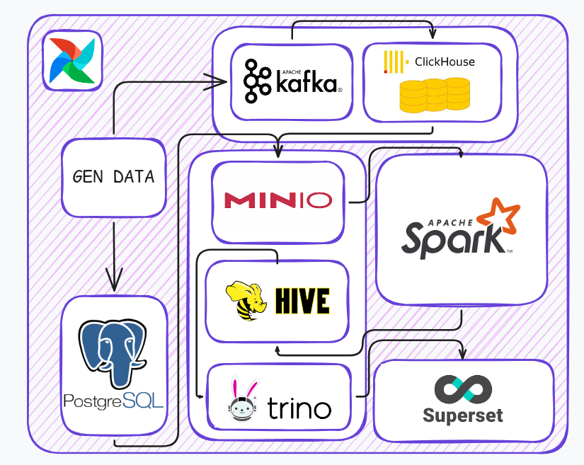
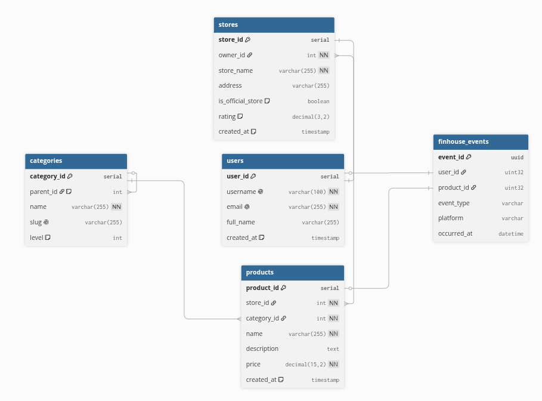
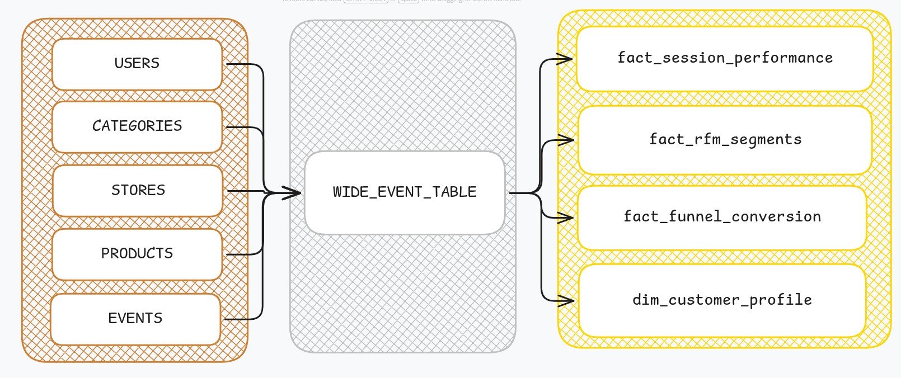
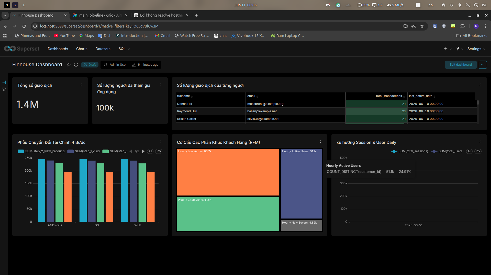

# Customer Behavior Analytics System


> **Project:** Customer Behavior Analytics System \
> **Tech Stack:** Airflow, Clickhouse, Hive, Kafka, MinIO, PostgreSQL, Spark, Superset, Trino \
> **Data Ingestion & Tiering:** Built automated batch pipelines via **Apache Airflow** and **Spark** to process **6M+ daily clickstream rows**, implementing a hot/cold tiering strategy (**ClickHouse** & **MinIO**) that reduced storage costs by **45%**. \
> **Distributed Query Engine:** Configured **Trino** to execute federated SQL analytics across the data lake, achieving a **< 150ms** query response for hot data and streamlining downstream OLAP structures. \
> **BI Visualization:** Integrated **Apache Superset** for real-time dashboards, delivering an end-to-end refresh rate of **< 1.2 seconds** for business-critical tracking.

---

## 📋 Table of Contents

- [Repository Structure](#-repository-structure)
- [High-level System Architecture](#-high-level-system-architecture)
- [Prerequisites](#-prerequisites)
- [Installation & Setup](#%EF%B8%8F-installation--setup)
- [Monitoring & Observability](#%EF%B8%8F-monitoring--observability)
- [Data Flow Pipeline](#-data-flow-pipeline)
- [Demo Video](#-demo-video)

---

## 📂 Repository Structure

```bash
├── assets
│   ├── images
│   │   └── architecture.png
│   └── videos
│       └── dashboard.gif
│       └── airflow.gif
├── dags
│   ├── gen_events.py
│   ├── main_pipeline.py
│   ├── __pycache__
│   │   ├── chouse_to_minio.cpython-312.pyc
│   │   ├── gen_data.cpython-312.pyc
│   │   ├── gen_events.cpython-312.pyc
│   │   ├── gen_init.cpython-312.pyc
│   │   ├── gen_random_events.cpython-312.pyc
│   │   └── main_pipeline.cpython-312.pyc
│   └── src
│       ├── init_db.py
│       ├── postgresql_to_minio.py
│       ├── random_events.py
│       └── spark
│           ├── customer_profile.py
│           ├── funnel_conversion_hourly.py
│           ├── rfm_segments.py
│           └── session_performance_hourly.py
├── logs
├── .env
├── docker-compose.yaml
├── README.md
├── plugins
│   └── utils
│       ├── __init__.py
│       └── logger_utils.py
├── README.md
└── services
    ├── airflow
    │   ├── Dockerfile
    │   └── requirements.txt
    ├── clickhouse
    │   ├── config.xml
    │   └── init_db.sql
    ├── hive
    │   ├── Dockerfile
    │   └── site.xml
    ├── kafka
    │   └── consumer
    │       ├── consumer.py
    │       ├── Dockerfile
    │       └── requirements.txt
    ├── minio
    │   └── entrypoint.sh
    ├── postgres
    │   └── init_db.sql
    ├── spark
    │   ├── Dockerfile
    │   └── jobs
    │       └── finhouse_analytics_master.py
    ├── superset
    │   ├── Dockerfile
    │   ├── init.sh
    │   └── requirements.txt
    └── trino
        ├── catalog
        │   └── hive.properties
        ├── entrypoint.sh
        └── init_db.sql
```

---

## 🏗 High-level System Architecture



### 1. Data Orchestration & Ingestion

- **Apache Airflow**: Orchestrates batch and event-driven data pipelines, managing scheduled data flows across the entire platform.
- **Apache Kafka**: Acts as the central high-throughput event streaming backbone, decoupling continuous data ingestion from downstream storage tiers.

### 2. Lakehouse Storage Tiering (Hot/Cold)

- **ClickHouse (Hot Tier)**: Serves as a high-performance, columnar OLAP database optimized for ultra-low latency real-time queries and analytical workloads.
- **MinIO (Cold Tier)**: Provides high-performance, S3-compatible object storage to systematically archive historical data logs and raw event dumps.

- **PostgreSQL**: Handles operational metadata, transactional states, and reference data storage within the ecosystem.

### 3. Distributed Processing & Cataloging

- **Apache Spark**: Executes automated ETL/ELT processing, handling complex transformations, data aggregation, and structural partitioning.

- **Apache Hive**: Manages data cataloging, schema definitions, and table metastores over the object storage layer.

### 4. Federated Query & BI Analytics

- **Trino**: Operates as a highly distributed, mass-parallel SQL query engine to perform fast, federated analytics directly across both hot and cold storage layers.

- **Apache Superset**: Powers interactive data visualization, rendering business-critical dashboards with optimized, sub-second refresh rates.



---

# 🔧 Prerequisites

To run the **J-DataPipe** project locally, ensure your machine meets the hardware requirements and has the following tools installed:

### 🖥️ Hardware Recommendations

Because the Lakehouse architecture runs multiple heavy-duty distributed engines (Spark, Trino, ClickHouse, and Kafka), your system should ideally have:

- **CPU**: 4+ Cores (8+ Threads recommended)

- **RAM**: : 16GB (Minimum 12GB allocated to Docker)

- **Storage**: 30GB free space (SSD preferred for ClickHouse and Kafka log storage)

### 🛠️ Required Tools

| Tool                        | Description                                                                                              | Download / Guide                                                 |
| :-------------------------- | :------------------------------------------------------------------------------------------------------- | :--------------------------------------------------------------- |
| **Docker & Docker Compose** | Essential container runtime to spin up the entire Lakehouse stack via a single compose file.             | [Download Here](https://www.docker.com/products/docker-desktop/) |
| **Python 3.13+**            | Required for local ML training (`models/`) and PyFlink development.                                      | [Download Python](https://www.python.org/downloads/)             |
| **Trino CLI / DBeaver**     | Highly recommended for connecting to Trino to execute federated SQL queries across MinIO and ClickHouse. | [Download Dbeaver](https://dbeaver.io/)                          |

---

### ✅ Verification

Run the following commands in your terminal to verify the installation:

```bash
# Verify container runtime environments
docker --version         # Check Docker engine version (Should be v20.10+)
docker compose version   # Ensure Docker Compose v2+ is installed

# Verify runtime language environments
python3 --version        # Ensure Python 3.11+ is active for PySpark/Airflow

# Verify client connectivity tools (Optional)
trino --version          # If you have Trino CLI installed locally
```

---

## 🕹️ Installation & Setup

```bash
# Copy .env.example to .env
cp .env.example .env

# Run Docker Compose
docker compose up -d

# Check container status
docker ps -a

```

## SETUP CONNECT

### Web UI Endpoints & Access

| Service Local       | URL                   | Default Credentials            |
| ------------------- | --------------------- | ------------------------------ |
| Apache Airflow      | http://localhost:8080 | admin / admin                  |
| Apache Superset     | http://localhost:8088 | (Thiết lập theo cấu hình init) |
| MinIO Console       | http://localhost:9001 | admin / supersecretpassword    |
| Kafka UI            | http://localhost:8086 | No Authentication              |
| Apache Spark Master | http://localhost:8082 | No Authentication              |

---

## 🖥️ Monitoring & Observability

The project integrates Apache Superset as the centralized BI and visualization platform. It connects directly to the distributed query engine (Trino) to perform federated queries across both hot and cold storage layers, rendering interactive dashboards with sub-second response times.

### Accessing the Interface

Since the service is fully containerized and exposed via Docker Compose, you can access the web interface directly on your local machine:

- **URL**: http://localhost:8088

- **Credentials**: Log in using the Admin account configured in your .env file.

### Connecting Trino to Apache Superset

To enable Superset to query data from your Lakehouse architecture via Trino, follow these quick setup steps:

1. On the Superset top-right navbar, navigate to **Settings** $\rightarrow$ Select **Database Connections**.
2. Click the **+ DATABASE** button to add a new connection.

3. Select **Trino** from the database engine dropdown list (if not visible, select Other).

4. Enter the following standard **SQLAlchemy URI** to allow internal container-to-container communication within the Docker network:

```Plaintext
trino://admin@trino:8080/hive
```

### Creating Dashboards

You are now ready to go to **Dashboards** $\rightarrow$ + **DASHBOARD** to build real-time analytical charts, track clickstream pipelines, and monitor business-critical metrics processed by Apache Spark and stored across MinIO and ClickHouse.

## 🌊 Data Model Architecture




## 🚢 Demo Video

### 1. High-Speed Interactive BI Dashboard

Real-time user behavior analytics, RFM customer segmentation, and conversion funnel dashboards powered by Trino and Apache Superset.    \


### 2. Airflow Orchestration & Pipeline Triggers

An overview of the master data pipeline executing batch jobs, schema cataloging, and hot/cold tier synchronization.     \

